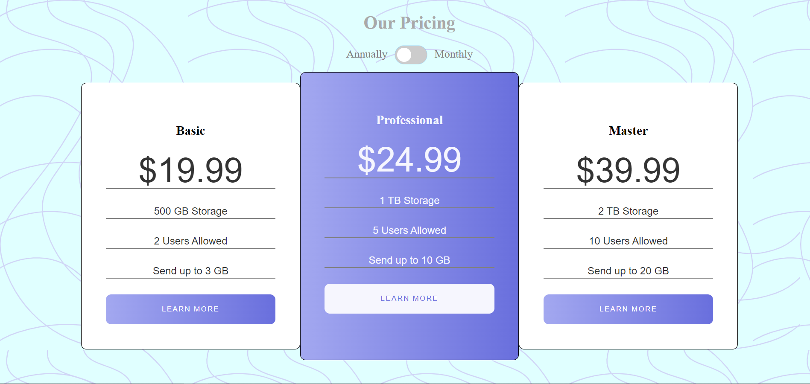

# Pricing component with toggle

## Overview

### The challenge

Your users should be able to:

-View the optimal layout for the component depending on their device's screen size

-Control the toggle with both their mouse/trackpad and their keyboard

### Screenshot

### Links

- Live Site URL: https://omer-yagci.github.io/Pricing-component-with-toggle/

### Built with

- Semantic HTML5 markup
- CSS custom properties
- Flexbox
- JavaScript event listeners
